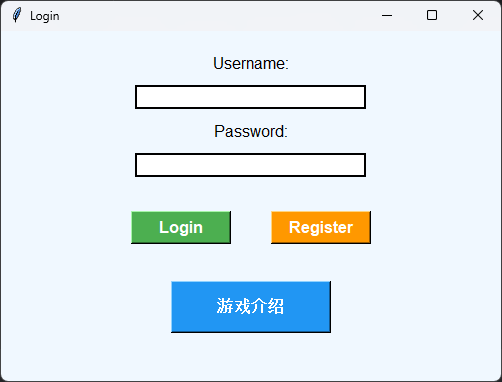
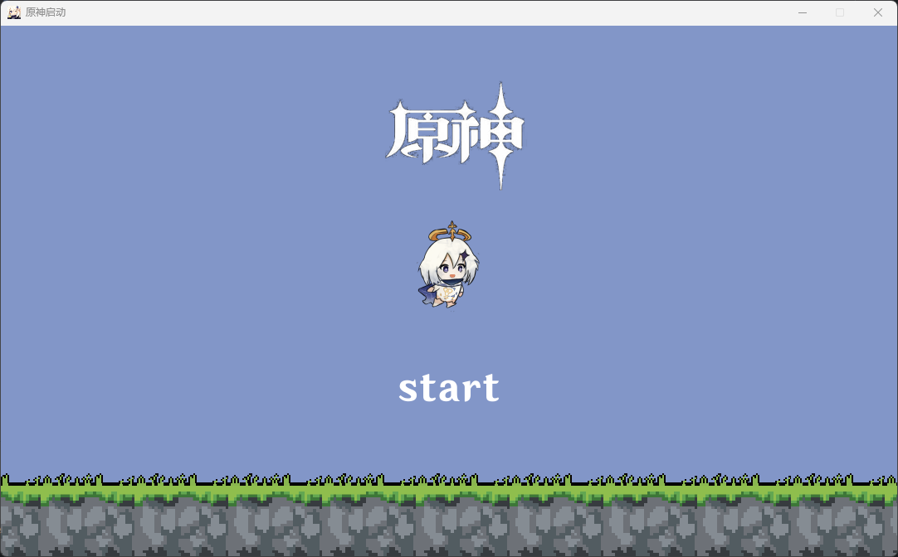
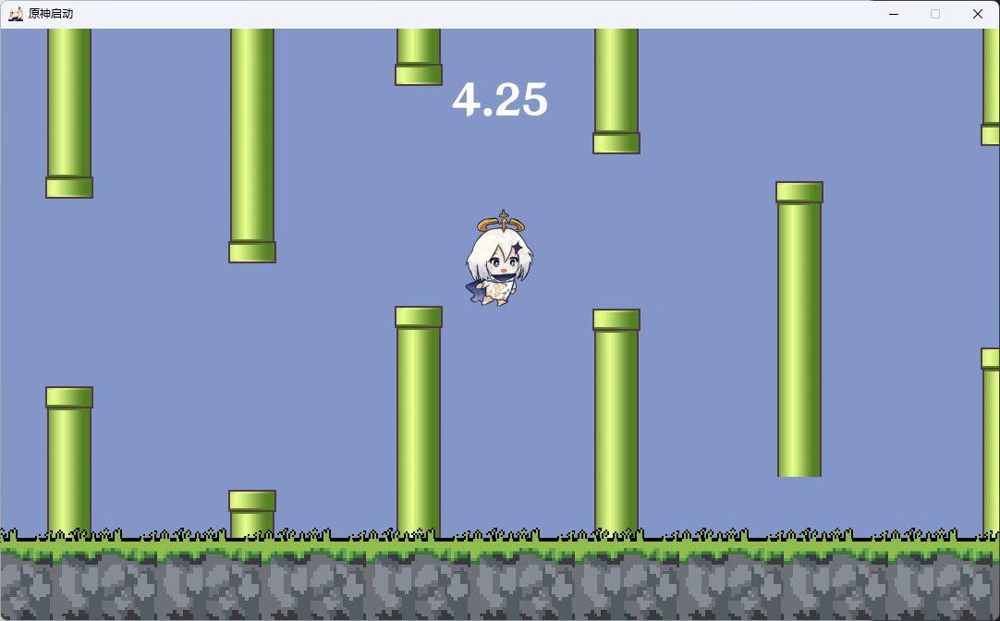
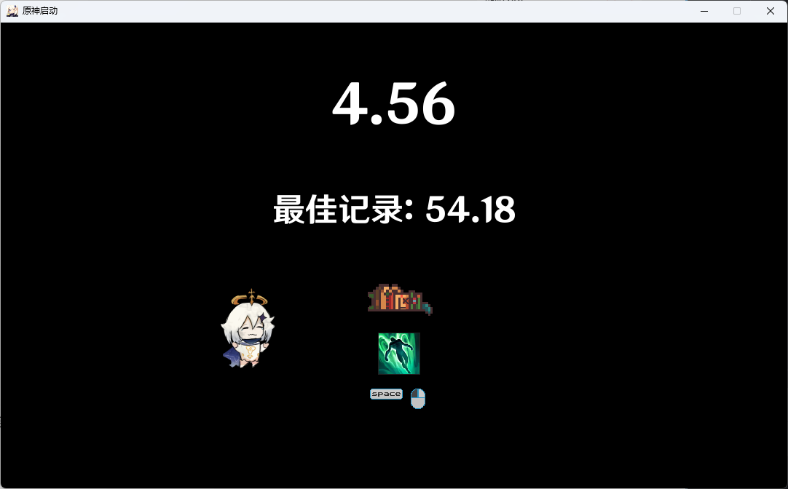

# 🐦 Pygame-Fly - 飞翔派蒙改进版
<div align="center">

[](https://www.python.org/)
[](https://www.pygame.org/)
[](https://docs.python.org/3/library/tkinter.html)
[](LICENSE)

**借鉴 ken-2511 飞翔派蒙项目，优化玩法与视觉体验，新增登录、数据记录及特色界面设计**

[功能特性](#-功能特性) • [快速开始](#-快速开始) • [项目结构](#-项目结构) • [环境要求](#-环境要求) • [界面展示](#-界面展示)

</div>

---

## 🌟 项目简介
本项目是基于 Pygame 开发的飞翔类小游戏，在原版「飞翔派蒙」基础上进行多维度优化，强化游戏趣味性与可玩性。核心玩法为操控角色躲避管道，同时新增计数器、特色鼠标指针、登录系统等功能，搭配参考 Steam 游戏《Dodge Show》设计的死亡界面，提升整体游戏体验。

> 注：原计划实现后端数据互通与实时排行榜功能，目前暂未完成，仅支持本地 JSON 记录最高数据。

---

## 🎯 功能特性
- **玩法优化**：设置高低间隔不同的管道提升难度，新增管道加速度机制（当前存在速度突变问题，可能导致穿模）
- **视觉升级**：替换开头原神元素与游戏名，添加阿玛尼特色鼠标指针，设计专属死亡结束画面
- **数据记录**：通过本地 JSON 文件存储玩家最高分数，支持数据持久化
- **登录系统**：支持用户名密码注册与登录，预设空账号密码方便快速体验，为后续多人玩法预留扩展空间
- **辅助功能**：配套本地 HTML 游戏说明文档，可快速了解游戏规则与操作

---

## 🚀 快速开始
### 启动命令
```bash
python login.py
```

### 操作说明
1. 运行启动文件后，进入登录界面（可直接用空账号密码登录）
2. 登录后可查看游戏介绍，点击进入游戏
3. 游戏中操控角色躲避管道，计数器实时统计得分
4. 碰撞管道后触发死亡界面，展示本次得分与历史最高得分

---

## 📂 项目结构
```
Pygame-Fly/
├── fonts/          # 字体文件存放目录
├── music/          # 音频文件存放目录
├── images/         # 图片资源存放目录（界面图、角色图等）
├── config.py       # 游戏基础参数配置文件
├── main.py         # 游戏主逻辑文件
├── login.py        # 登录界面逻辑文件
├── Sprites.py      # 游戏精灵类定义（角色、管道等）
├── Text.py         # 文本图片显示封装类
├── README.md       # 项目说明文档
└── history.json # 最高分数记录文件（自动生成）
```

---

## 📊 环境要求
| 依赖模块   | 版本要求  | 说明                     |
|------------|-----------|--------------------------|
| Python     | 3.11.9    | 游戏运行基础环境         |
| Pygame     | 2.5.2     | 游戏图形、音频渲染核心   |
| Tkinter    | 8.6.12    | 登录界面与辅助窗口支撑   |

> 注：Tkinter 为 Python 标准库，随 Python 安装自带，无需额外安装；Pygame 可通过 `pip install pygame==2.5.2` 安装

---

## 🖼️ 界面展示
### 登录界面


支持账号注册与登录，预设空账号密码可直接进入，登录后可查看游戏介绍。


### 核心界面（横向排列）
| 开始界面                                | 游戏界面 | 死亡界面 |
|-------------------------------------|----------|----------|
|  |  |  |

- 开始界面：展示游戏名，支持快速开始游戏
- 游戏界面：实时显示分数，管道随机生成，角色可操控躲避
- 死亡界面：展示本次得分与历史最高分，支持重新开始游戏

---

## 🎮 最后
本项目为个人改进练习作品，欢迎大家体验并提出优化建议！希望大家玩得开心～


